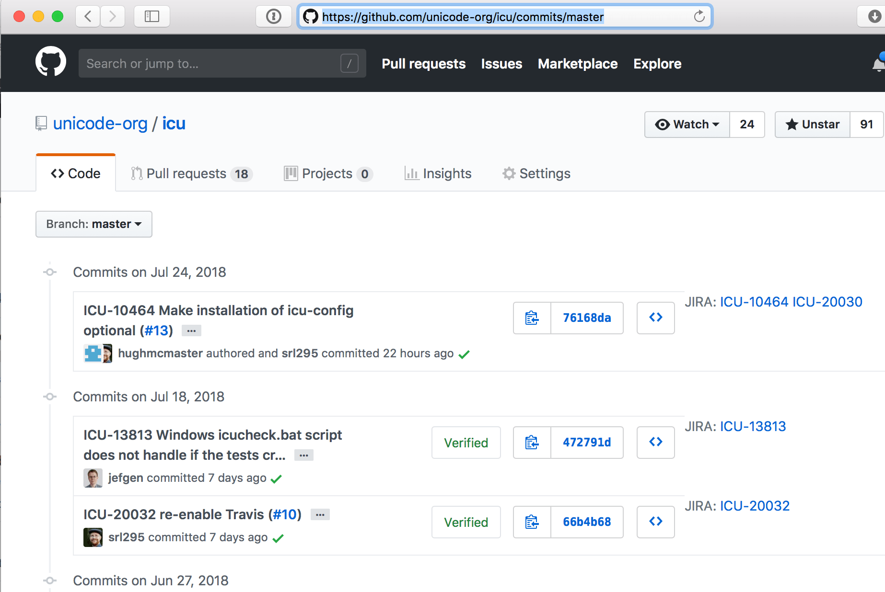

### ICU JIRA safari extension

make `ICU-1234` linkified in Safari.

## installation

[I](https://github.com/srl295) don't have a safari extension certificate thing, so you won't see this in the App Store this week. But the following might work:

1. turn on Develop mode in Safari
2. go to Develop->Extension Builder
3. go to the `+` and choose Add Extension…
4. select the `IcuSafariJari.safariextension` subdirectory
5. verify the whitelist, or even the script. Are you sure you want to do this?
6. click the Install button in the top left.

### License

Copyright © 2016-2024 Unicode, Inc. Unicode and the Unicode Logo are registered trademarks of Unicode, Inc. in the United States and other countries.

The project is released under [LICENSE](./LICENSE).

A CLA is required to contribute to this project - please refer to the [CONTRIBUTING.md](https://github.com/unicode-org/.github/blob/main/.github/CONTRIBUTING.md) file (or start a Pull Request) for more information.

